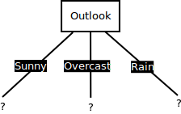
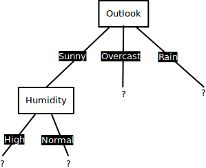
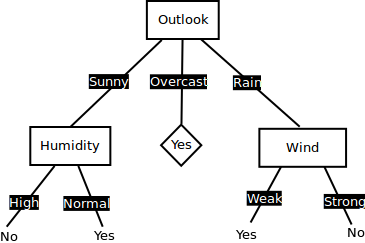

# ID3 Classification Trees: Perfect Split with Information Gain - Lab

## Introduction

In this lab, we will simulate the example from the previous lesson in python. We will write functions to calculate entropy and IG which will be used for calculating these uncertainty measures and deciding upon creating a split using information gain while growing a ID3 classification tree. We shall attempt to write general function that can be used for other (larger)  problems as well. So let's get on with it. 

## Objectives
You will be able to:
- Write functions for calculating Entropy and Information gain measures
- Identify the attribute for best split at master and each subsequent node


## Problem

We shall use the same problem about deciding weather to go and play tennis on a given day, given the weather conditions. Here is the data from previous lesson:


## Write a function `entropy(pi)` to calculate total entropy in a given discrete probability distribution `pi`

- The function should input a probability distribution `pi` as an array of class distributions
- Calculate and return entropy according to the formula: $$Entropy(p) = -\sum (P_i . log_2(P_i))$$


```python
from math import log
def entropy(pi):
    '''
    return the Entropy of a probability distribution:
    entropy(p) = - SUM (Pi * log(Pi) )
    '''

    pass


# Test the function 

print(entropy([1,1])) # Maximum Entropy e.g. a coin toss
print (entropy([0,6])) # No entropy, ignore the -ve with zero , its there due to log function
print (entropy([2,10])) # A random mix of classes

# 1.0
# 0.0
# 0.6500224216483541
```

    None
    None
    None


## Write a function `IG(D,a)` to calculate the information gain 

- The function should input `D` as a class distribution array for target class, and `a` the class distribution of the attribute to be tested
- Using the `entropy()` function above, calculate the information gain as:

$$gain(D,A) = Entropy(D) - \sum(\frac{|D_i|}{|D|}.Entropy(D_i))$$

where `Di` represents distribution of each class in `a`.


```python
def IG(D, a):
    '''
    return the information gain:
    gain(D, A) = entropy(D)− SUM( |Di| / |D| * entropy(Di) )
    '''

    pass


# Uncomment to run the test

# set of example of the dataset - distribution of classes
test_dist = [6, 6] # Yes, No
# attribute, number of members (feature)
test_attr = [ [4,0], [2,4], [0,2] ] # class1, class2, class3 of attr1 according to YES/NO classes in test_dist

print(IG(test_dist, test_attr))

# 0.5408520829727552
```

    None


## First Iteration - Decide Best Split for master node

- Create The class distribution `play` as a list showing frequencies of both classes from the dataset
- Similarly create variables for four categorical feature attributes showing the class distribution for each class with respect to the target classes (yes and no)
- Pass the play distribution with each attribute to calculate the information gain


```python


# Your code here


# Information Gain:

# Outlook: 0.2467498197744391
# Temperature: 0.029222565658954647
# Humidity: 0.15183550136234136
# Wind:, 0.04812703040826927
```

    Information Gain:
    
    Outlook: 0.2467498197744391
    Temperature: 0.029222565658954647
    Humidity: 0.15183550136234136
    Wind:, 0.04812703040826927


We see here that the outlook attribute gives us the highest value for information gain, hence we choose this for creating a split at root node. So far we have our root node looking as below:


## Second Iteration

For the branch (edge) of three above that leads to the "Sunny" outcome. Check for temperature, humidity and wind attributes to see which one provides the highest information gain. 

For the steps as above. __Remember we only have 2 positive and 3 negative examples in the "sunny" branch.__ 


```python


# Your code here 


# Information Gain:

# Temperature: 0.7974288158134881
# Humidity: 0.9402859586706309
# Wind:, 0.5117145300992023

```

    Information Gain:
    
    Temperature: 0.7974288158134881
    Humidity: 0.9402859586706309
    Wind:, 0.5117145300992023


So here we see that humidity gives us the the highest information gain, so we shall use this to split our tree as shown below:


Let's now see how to get to the leaf nodes using the branches from the node which we split on humidity above. 

## Third Iteration

We now have humidity which has two possible values [High, Normal]. A branch High dominated by single label which is __No__, caused this branch ended with a leaf contains label No. Same case with branch Normal which ended with a leaf contains label __Yes__. so we dont split these leaves any further as they are now "pure leaves" and will get shown as below:


## Fourth Iteration

All rows contains value "Overcast" contain single label __Yes__ in the target, so branch of Overcast ends with a leaf contains label __Yes__. Just like above, it is a pure leaf and wont get split any further. 


## Fifth Iteration

We will now check which is the best attribute for branch of "Rain". Remember, that new distribution is only rows containing values of Rain i.e. 3 positive and 2 negative examples. Repeat the process we did for master node and second iteration to see which attribute gives the best information gain.


```python


# Your code here


# Information Gain:

# Temperature: 0.01997309402197489
# Humidity: 0.01997309402197489
# Wind:, 0.9709505944546686
```

    Information Gain:
    
    Temperature: 0.01997309402197489
    Humidity: 0.01997309402197489
    Wind:, 0.9709505944546686


Right, its wind this time, giving us the highest information gain. So that is what we use for the split. This will result as following:


## Sixth Iteration

Next node is an attribute "Wind" with two possible classes [Weak, Strong]. A branch Strong dominated by single label which is __No__, caused this branch ended with a leaf contains label No. Same case with branch Weak which ended with a leaf contains label __Yes__. so no further splitting is required and we can declare these as leaf nodes as shown below.


So now we have all branches ending on leaf nodes, and these nodes are "pure" containing only positive or negative examples. So no further splitting is required and we now have a decision tree ready for classification. Also, notice that we did not use the the "Temperature" for splitting at any stage. We have effectively "pruned" that feature to leave it out of the training process as it we have better predictors helping us fully tidy up the data. We shall look more into pruning in following lessons. 

## Summary 

Decision tree is a very simple model that you can build from starch easily. One of popular Decision Tree algorithm is ID3. Basically, we only need to construct tree data structure and implements two mathematical formula to build complete ID3 algorithm as we saw above. We shall look into this implementation with sklearn in our next lesson. 
